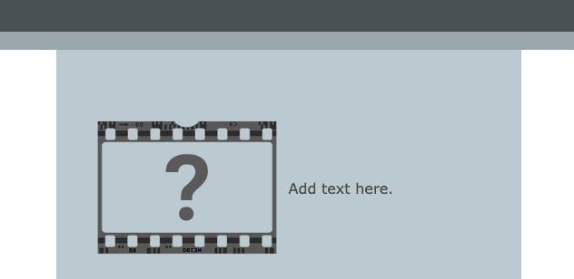
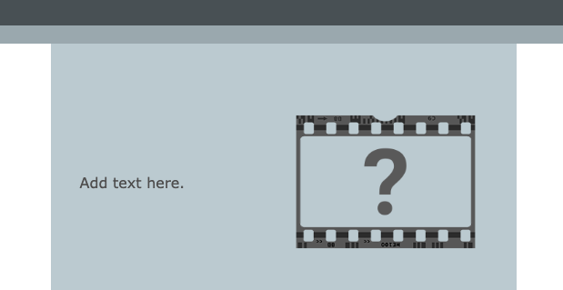

--- code ---
---
language: html
filename: index.html
line_numbers: false
---

<section class="wrap">
    
    

        
Add text here.

    

</section>

--- /code ---

You can swap the order of the `` and `
` elements if you want the text to come first.

