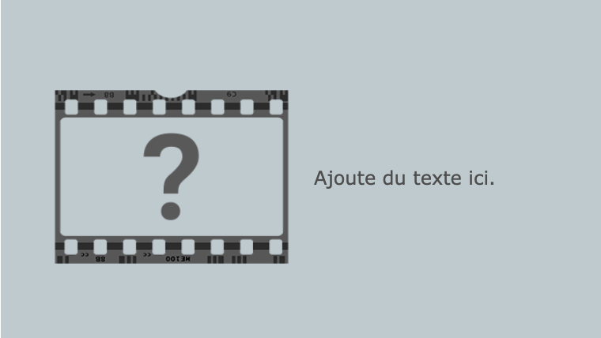

--- code ---
---
language: html
filename: index.html
line_numbers: false
---

<section class="wrap">
    
    

        
Ajoute du texte ici.

    

</section>

--- /code ---

Tu peux intervertir l'ordre des éléments `` et `
` si tu veux que le texte passe en premier.

