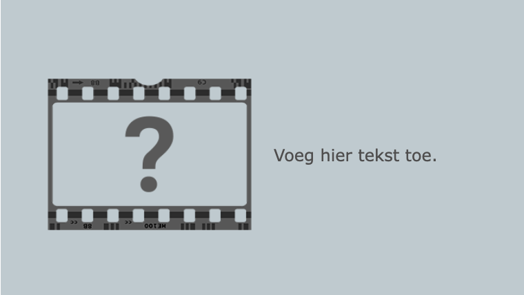

## --- code ---

language: html
filename: index.html
line_numbers: false
--------------------------------------------------------

<section class="wrap">
    
    

        
Voeg hier tekst toe.

    

</section>

\--- /code ---

Je kunt de volgorde veranderen van de `` en `
` elementen als je wilt dat de tekst eerst komt.

