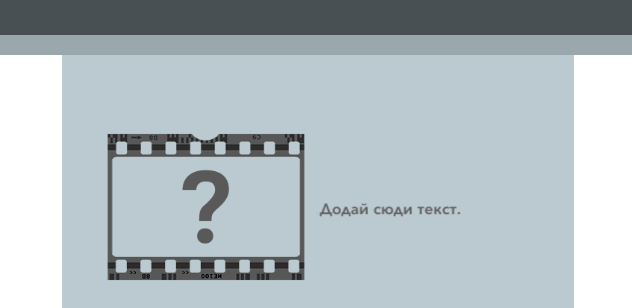
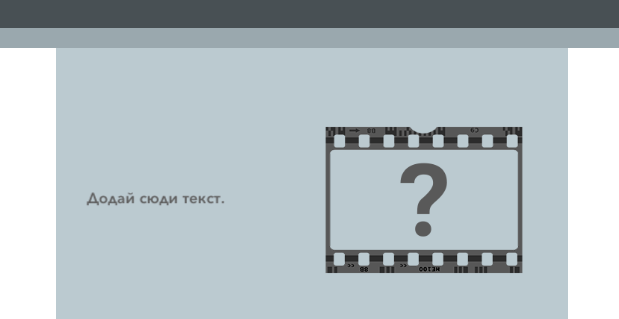

## --- code ---

language: html
filename: index.html
line_numbers: false
--------------------------------------------------------

<section class="wrap">
    
    

        
Додай сюди текст.

    

</section>

\--- /code ---

Ти можеш поміняти місцями порядок елементів `` та `
`, і тоді текст буде першим.

