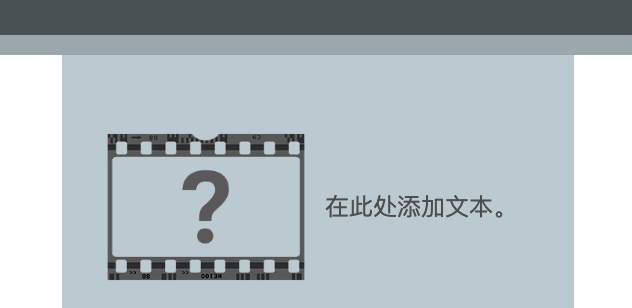

## --- code ---

language: html
filename: index.html
line_numbers: false
--------------------------------------------------------

<section class="wrap">
    
    

        
在此处添加文本。

    

</section>

\--- /code ---

如果您希望文本优先显示，可以交换 `<0>` 和 `<1>` 元素的顺序。

